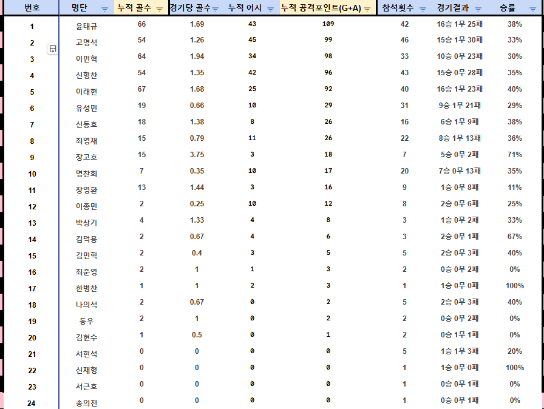
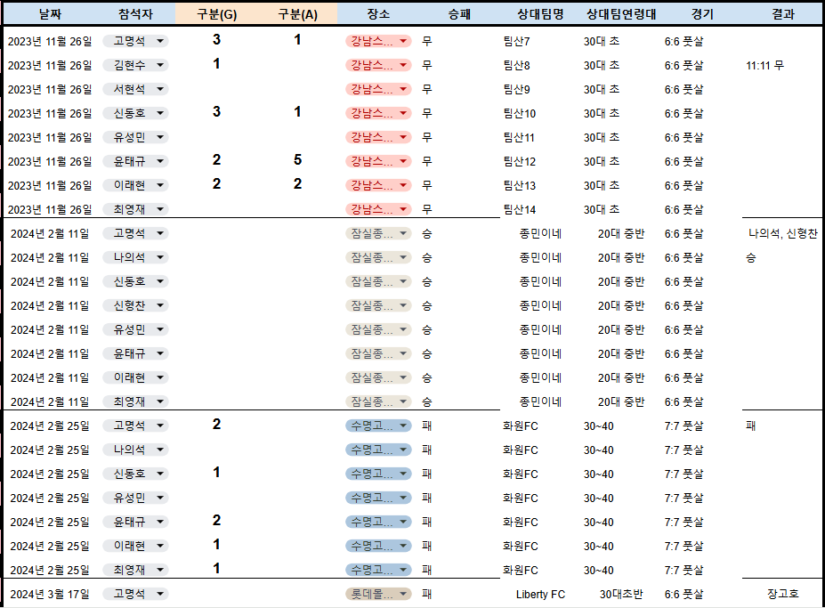
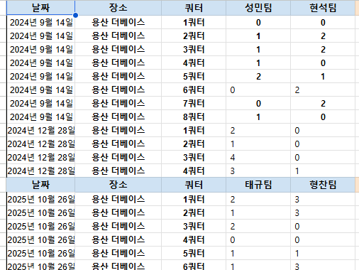
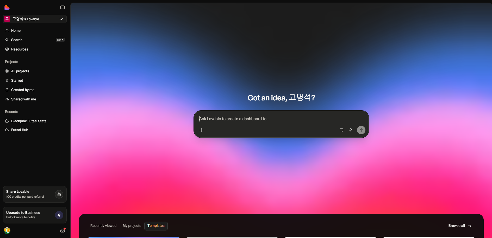

# 1편. 엑셀로 2년을 버티다 — 기획자가 앱을 만들어야겠다고 결심한 날

> **바이브코딩 일대기** | 수학과·컴공과 출신 기획자가 Lovable로 풀스택 앱을 처음 만든 현실 연재. 총 10편.

---

## 먼저, 나는 어떤 사람인가

솔직히 말하면, 나는 코딩을 아예 모르는 건 아니다.

수학과, 컴퓨터공학과를 나왔고 IT기업에 2년정도 근무를 했다. 코드를 보면 대충 무슨 말인지는 읽힌다. SQL 쿼리 구조 정도는 이해한다. 근데 **직접 풀스택 앱을 처음부터 끝까지 만들어본 적은 없었다.**

프론트엔드를 짜고, 백엔드 API를 연결하고, DB 스키마를 설계하고, 거기에 실제 데이터를 넣고, 배포까지 — 이 흐름을 혼자 처음부터 해본 적이 없었다는 얘기다.

그래서 이 시리즈는 "코딩 1도 모르는 사람이 AI로 앱 만들기" 같은 이야기가 아니다. **기술적 베이스는 있는데, 실제로 만들어본 경험은 없는 사람이 Lovable이라는 도구를 만났을 때 어떻게 되는가** — 그 기록이다.

---

## 2년간 엑셀과 싸웠다

조기축구팀 총무를 맡은 지 2년이 넘었다.

경기 날짜, 장소, 참석자, 골, 도움, 승패, 상대팀 연령대... 2023년 11월 첫 경기부터 2026년 3월까지 수십 번의 경기 기록이 쌓였다. 강남스타 풋살장에서 팀산 FC와 11:11로 비긴 첫 경기부터, 용산 더베이스에서 열린 수많은 경기들까지.

기록은 쌓이는데 **꺼내볼 방법이 없었다.**

---

---

## 불편함 1. 질문 하나에 5분씩

"고명석이 올 시즌 총 골이 몇 개야?"

단체방에 이런 질문이 오면, 나는 엑셀을 열고 이름 필터 걸고, 자체전 제외하고, 골 컬럼 수작업으로 세고... 이 과정을 반복해야 했다.

팀원 입장에선 가벼운 질문이다. 총무 입장에선 매번 5분짜리 작업이다.

---

---

## 불편함 2. 연령대 데이터가 엉망이었다

"우리 팀이 30대 중반 팀한테 유독 약한 것 같지 않아?"

감은 있었다. 근데 데이터로 확인할 수가 없었다.

이유가 있었다. 상대팀 연령대를 그냥 텍스트로 입력했기 때문이다. 같은 팀인데 "30대초", "30대 초반", "30대초반", "30대(초)"... 입력하는 사람마다 다 다르게 쳤다.

DB를 다루는 사람이라면 바로 알 것이다. 이 상태로는 `GROUP BY`가 불가능하다. 정제 없이는 의미 있는 집계가 안 나온다.

---

## 불편함 3. 자체전이라는 진짜 문제

그리고 가장 심각한 게 따로 있었다.

우리 팀은 **자체전**을 한다. 팀 내에서 A팀 vs B팀으로 나눠 치르는 경기다. 이걸 일반 외부 경기와 같은 포맷으로 엑셀에 넣다 보니 통계가 완전히 망가졌다.

장고호가 자체전에서 6골을 넣으면 — 외부 팀 상대로 넣은 골처럼 집계됐다. 연령대 승률 분석에 자체전 전적이 섞였다. 상대팀 컬럼에 뭘 써야 할지 몰라서 "자체전", "자체", "A vs B" 같은 텍스트가 뒤섞였다.

> **"자체전에서 장고호가 6골 넣은 게 외부 팀 상대로 넣은 것처럼 나오잖아."**

팀원의 이 한마디가 오래 머릿속에 남았다.

테이블 설계를 조금이라도 아는 사람은 알 것이다. 이건 단순한 입력 실수가 아니다. **도메인 로직 자체가 스키마에 반영이 안 된 것**이다.

---

---

## 그래서 2년치 데이터 규모가 어떻게 됐냐면

이 불편함을 감수하면서도 기록을 놓지 않았다. 2년이 지나니 이런 규모가 됐다.

- 총 경기 수: **87경기** (2023.11 ~ 2026.02)
- 등록 선수: **34명** (0번 김민혁 ~ 66번 이민혁)
- 기록된 상대팀: **20팀 이상**
- 경기장: **10곳 이상** (강남스타 풋살장, 용산 더베이스 등)

데이터는 있었다. 문제는 꺼내볼 도구가 없다는 것이었다.

87경기 데이터가 엑셀에 묻혀 있는 게 아까웠다. 이걸 제대로 분석할 수 있는 구조로 옮기고 싶었다.

---

---

## 그날 밤 검색창에 입력한 것

2025년 초였다. 또 누군가 물었다.

"이민혁이랑 신형찬이 같이 뛸 때 득점이 더 잘 나오지 않아?"

나는 또 엑셀을 열었다. 그리고 생각했다.

> *이걸 왜 내가 매번 손으로 세고 있지?*

그날 밤 처음으로 검색했다. **"코딩 없이 앱 만들기."**

그리고 **Lovable(러버블)** 이라는 AI 코딩 툴을 발견했다.

---

---

## 왜 Lovable이었나

Lovable은 자연어 프롬프트를 입력하면 React 기반의 웹앱을 실시간으로 생성해 주는 도구다. Supabase와 연동해서 DB까지 붙인다.

코드를 아예 모르는 사람도 쓸 수 있다고 홍보한다. 근데 나는 좀 다른 이유로 흥미가 생겼다.

**코드를 읽는 건 되는데 처음부터 짜는 건 해본 적 없는 사람**이 이 도구를 쓰면 어떻게 될까. 프론트엔드-백엔드-DB를 연결하는 그 흐름 전체를 AI가 잡아주고, 나는 도메인 로직만 정확하게 설명하면 되는 구조가 될 수 있을까.

그게 궁금했다.

---

## 이 시리즈에서 다루는 것

10편에 걸쳐 이 과정을 기록한다.

단순한 "AI로 투두앱 만들기" 수준이 아니다. 실제 복잡한 도메인 로직이 있는 앱을 만드는 과정이다.

- 자체전과 외부 경기를 어떻게 DB 스키마로 분리하는가
- 연령대 텍스트를 어떻게 정규화해서 집계 쿼리를 쓸 수 있게 만드는가
- 코트 마진(+/-), PPQ 같은 복합 지표를 어떻게 SQL로 구현하는가
- AI가 틀렸을 때 어떻게 프롬프트로 잡아내는가

멋진 성공담이 아니다. 오류 나고, 욕 나오고, 포기하고 싶었던 순간들도 있다. 그리고 결국 작동하는 무언가가 생겼을 때의 쾌감도 있다.

그 모든 것을 담는다.

---

---

**다음 편:** [2편. Lovable + Supabase + Gemini 삼각편대 — 첫 화면이 생성되기까지]()

---
