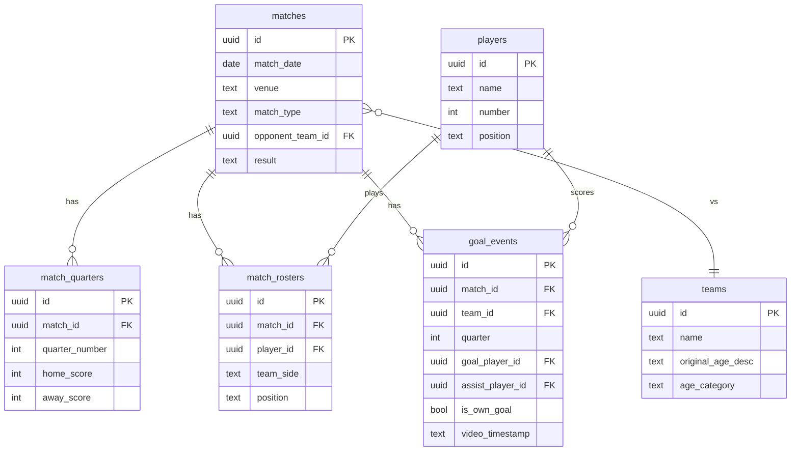

> **바이브코딩 일대기** | 수학과·컴공과 출신 기획자가 Lovable로 풀스택 앱을 처음 만든 현실 연재. 총 10편.

---

## 앱 뼈대는 생겼다. 근데 데이터가 없다

2편에서 Lovable로 앱 뼈대를 만들었다. 화면이 생겼고, Supabase 연동도 됐다.

근데 DB가 비어 있었다.

2년치 경기 데이터가 엑셀에 있었다. 이걸 DB로 옮겨야 했다. 단순히 복사-붙여넣기가 아니다. **엑셀의 뒤죽박죽한 raw 데이터를 쿼리 가능한 구조로 바꾸는 작업**이었다.

---

## 엑셀 데이터가 실제로 어떻게 생겼냐면

엑셀에서 복사한 날 것의 데이터는 이렇게 생겼다.

```
2023년 11월 26일 고명석 31 강남스타 풋살장 무 팀산7 30대초 6:6풋살
2023년 11월 26일 김현수 1 강남스타 풋살장 무 팀산8 30대초 6:6풋살 11:11 무
2024년 3월 15일 장고호 6 용산 더베이스 승 자체전 - 6:6풋살
...
```

문제가 한눈에 보인다.

| 문제 | 내용 |
|------|------|
| 컬럼 구분 없음 | 공백으로 구분돼 있어서 어디서 끊어야 할지 모름 |
| 연령대 표기 제각각 | "30대초", "30대 초반", "30대초반" 혼재 |
| 자체전 처리 없음 | 상대팀 칸에 "자체전"이라고 텍스트로 들어가 있음 |
| 날짜 형식 불통일 | "2023년 11월 26일", "23.11.26" 혼재 |

이걸 그대로 DB에 넣는 건 불가능했다. 먼저 구조를 설계해야 했다.

---

## DB 스키마를 어떻게 설계했나

엑셀 데이터를 Gemini한테 던지기 전에, 먼저 어떤 테이블이 필요한지 물었다.

**내가 Gemini한테 넣은 프롬프트:**

```
조기축구팀 데이터 분석 앱의 Supabase DB 스키마를 설계해줘.

[저장해야 할 데이터]
- 경기: 날짜, 장소, 경기 유형(외부/자체전), 결과, 상대팀
- 선수: 이름, 등번호, 포지션
- 경기 참석: 어떤 경기에 어떤 선수가 나왔는지
- 골/도움: 누가 넣고 누가 어시스트했는지, 몇 쿼터에, 자책골 여부
- 상대팀: 팀명, 원본 연령대 텍스트, 정규화된 연령대 카테고리

[제약 조건]
- 자체전은 상대팀이 없고 A팀/B팀으로 나뉨
- 나중에 연령대별 승률, 선수별 스탯, 쿼터별 득실 분석을 할 것임
- Supabase PostgreSQL 기준으로 작성해줘
```

**Gemini가 잡아준 테이블 구조:**



테이블 6개다. 엑셀의 평면적인 구조가 관계형 DB로 바뀐 것이다.

---

## 엑셀 → DB, 무엇이 달라졌나

Before/After를 비교하면 이렇다.

| | 엑셀 (Before) | DB (After) |
|--|--------------|------------|
| 구조 | 한 행에 모든 정보 | 테이블로 분리, FK로 연결 |
| 선수 정보 | 이름 텍스트로 반복 입력 | players 테이블에 한 번만 저장 |
| 상대팀 연령대 | "30대초", "30대초반" 혼재 | age_category로 정규화 |
| 자체전 | 상대팀 칸에 "자체전" 텍스트 | match_type = 'internal' 플래그 |
| 골 기록 | 선수별 합계만 | goal_events로 쿼터·어시스트 전부 |
| 쿼터 스코어 | 없음 | match_quarters 테이블로 관리 |

---

## 연령대 정규화 — 가장 공들인 부분

상대팀 연령대는 따로 시간을 들여서 정리했다.

나중에 "30대 팀 상대 승률은?" 같은 쿼리를 쓰려면 `GROUP BY age_category`가 가능해야 한다. 텍스트가 제각각이면 집계가 안 된다.

**내가 Gemini한테 넣은 프롬프트:**

```
아래 상대팀 목록의 연령대를 분석해서 정규화된 age_category로 분류해줘.
나중에 GROUP BY age_category로 승률 집계할 거니까
카테고리가 너무 세분화되면 안 되고, 너무 뭉뚱그려도 안 됨.

[상대팀 목록]
팀산FC - 30대초
NDB유나이티드 - 2030혼합
잔디FS - 20대후반~30대초
FC팝퍼스 - 2030혼합
청익FC - 20대후반~30대
화원FC - 3040혼합
AFFC - 20대후반
as lato - 20대
FC훌리건 - 2030혼합
장모fc - 30대중반
삼성FC - 30대후반
FC오리엔탈 - 30대후반~40대
...
```

**Gemini가 만들어준 정규화 결과:**

| 상대팀 | 원본 텍스트 | age_category |
|--------|------------|--------------|
| 팀산FC | 30대초 | 30대 초반 |
| NDB유나이티드 | 2030혼합 | 2030 혼합 |
| 잔디FS | 20대후반~30대초 | 2030 혼합 |
| FC팝퍼스 | 2030혼합 | 2030 혼합 |
| 청익FC | 20대후반~30대 | 2030 혼합 |
| 화원FC | 3040혼합 | 3040 혼합 |
| AFFC | 20대후반 | 20대 후반 |
| as lato | 20대 | 20대 초중반 |
| FC훌리건 | 2030혼합 | 2030 혼합 |
| 장모fc | 30대중반 | 30대 중반 |
| 삼성FC | 30대후반 | 30대 후반 |
| FC오리엔탈 | 30대후반~40대 | 3040 혼합 |

최종 카테고리는 8개로 정리됐다: `20대 초중반` / `20대 후반` / `2030 혼합` / `30대 초반` / `30대 중반` / `30대 후반` / `3040 혼합` / `40대 이상`

---

## 데이터 넣다가 만난 첫 에러

스키마 설계가 끝나고 실제 데이터를 INSERT하기 시작했다. 그리고 바로 에러가 났다.

```
column "original_age_desc" of relation "teams" does not exist
```

원인은 단순했다. `CREATE TABLE IF NOT EXISTS`는 테이블이 이미 있으면 그냥 넘어간다. 새 컬럼이 추가가 안 된 것이다.

**내가 Gemini한테 넣은 프롬프트:**

```
Supabase에서 아래 에러가 났어.

[에러]
column "original_age_desc" of relation "teams" does not exist

[상황]
- teams 테이블은 이미 존재함
- original_age_desc 컬럼을 추가하려고 CREATE TABLE IF NOT EXISTS 재실행했는데 에러남
- 기존 데이터는 지우면 안 됨

원인이 뭔지, Supabase SQL 에디터에 바로 붙여넣을 수 있는 해결 쿼리 줘.
```

**Gemini가 준 해결책:**

```sql
-- ❌ 이렇게 하면 테이블이 이미 있을 때 새 컬럼이 무시됨
CREATE TABLE IF NOT EXISTS teams (
  id uuid PRIMARY KEY,
  name text,
  original_age_desc text,  -- 이 컬럼이 추가 안 됨!
  age_category text
);

-- ✅ 해결책 1: 컬럼만 따로 추가 (데이터가 이미 있을 때)
ALTER TABLE teams
ADD COLUMN IF NOT EXISTS original_age_desc text;

-- ✅ 해결책 2: 테이블 재생성 (초기 세팅 단계일 때만)
DROP TABLE IF EXISTS teams;
CREATE TABLE teams (
  id uuid PRIMARY KEY DEFAULT gen_random_uuid(),
  name text UNIQUE NOT NULL,
  original_age_desc text,
  age_category text
);

-- ✅ 중복 삽입 방지 패턴 (데이터 재투입할 때 유용)
INSERT INTO teams (name, age_category)
VALUES ('FC팝퍼스', '2030 혼합')
ON CONFLICT (name) DO UPDATE
SET age_category = EXCLUDED.age_category;
```

데이터가 이미 들어가 있었으니 `ALTER TABLE`로 해결했다.


## 실제 데이터가 들어간 goal_events 테이블

데이터를 다 넣고 나면 Supabase Table Editor에서 이렇게 보인다.


409개 레코드. 2년치 골/도움 기록이 전부 들어간 것이다.

`match_id`, `team_id`, `quarter`, `goal_player_id`, `assist_player_id`, `is_own_goal` — 컬럼 하나하나가 나중에 분석 쿼리의 재료가 된다.

---

## 이 편에서 배운 것

**데이터 설계가 분석의 90%를 결정한다.**

엑셀에서 "30대초"라고 대충 입력했던 것들이 DB에서는 `age_category = '30대 초반'`으로 정규화됐다. 이 한 줄 차이가 나중에 `GROUP BY age_category`로 연령대별 승률을 뽑을 수 있느냐 없느냐를 결정한다.

그리고 에러가 났을 때 겁먹지 않게 됐다. 에러 메시지를 Gemini한테 그대로 복사해서 붙여넣으면 원인과 해결책이 같이 나온다.

> **에러 메시지는 문제가 아니라 정보다.**

4편에서는 이 구조 위에서 가장 골치 아팠던 문제 — 자체전 로직을 다룬다.

---

**다음 편:** [4편. 자체전이라는 괴물 — 가장 복잡한 로직과의 싸움]()

---

*바이브코딩 일대기 전체 목차는 [여기]()에서 확인할 수 있습니다.*