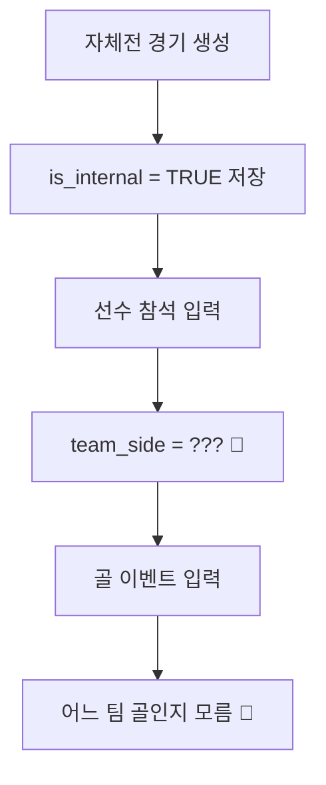
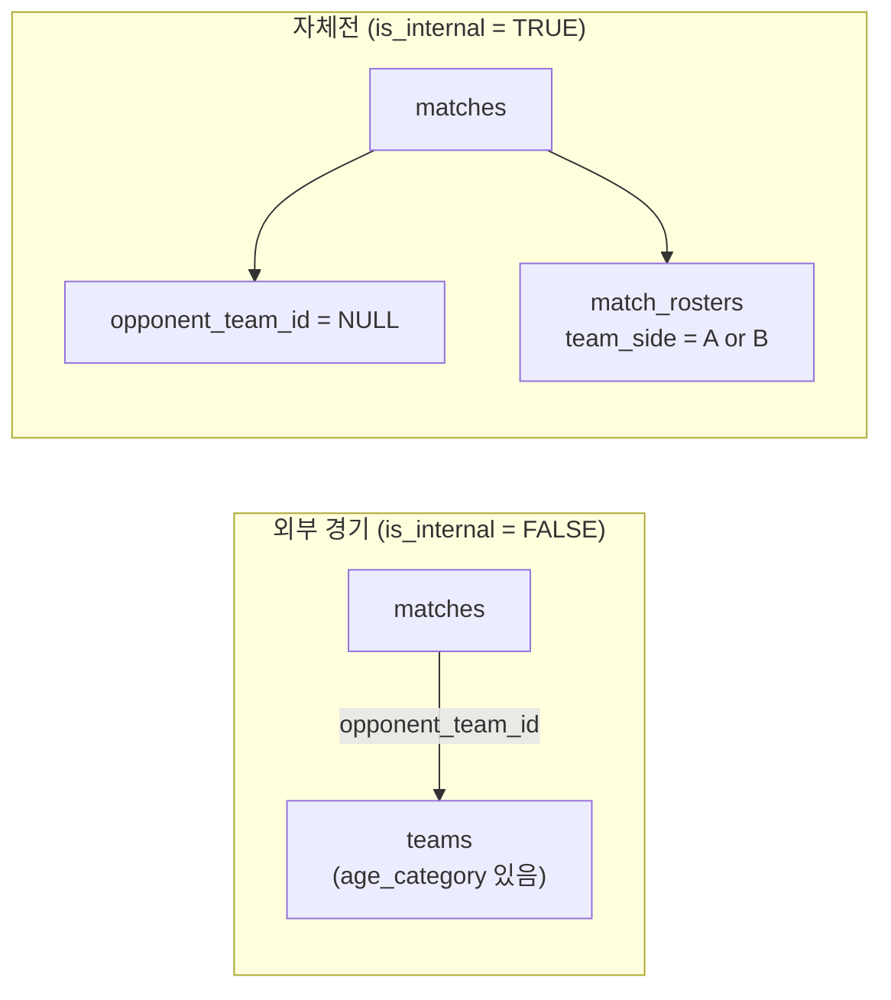
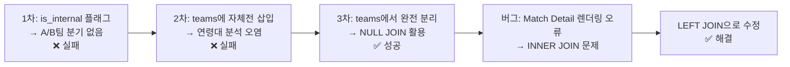

> **바이브코딩 일대기** | 수학과·컴공과 출신 기획자가 Lovable로 풀스택 앱을 처음 만든 현실 연재. 총 10편.

---

## 자체전이 뭐가 문제냐고?

단순해 보인다. 우리 팀이 둘로 나뉘어 치르는 경기다.

```
2024년 9월 14일 — 현석팀 10 : 6 성민팀
2024년 12월 28일 — 형찬팀 승
2025년 10월 26일 — 형찬팀 10 : 7 태규팀
```

근데 실제 txt 파일에서 이 데이터가 어떻게 생겼냐면:

```
2024년 9월 14일  고명석  3  용산 더베이스  패  자체전 "성민팀"  6:6풋살  10:6 현석팀 승
2024년 9월 14일  장고호  6  용산 더베이스  승  자체전 "현석팀"  6:6풋살
2024년 9월 14일  이민혁  1  용산 더베이스  패  자체전 "성민팀"  6:6풋살
```

문제가 보인다. **같은 경기인데 행이 두 덩어리로 나뉘어 있다.** 성민팀 선수들은 "패", 현석팀 선수들은 "승"으로 각각 따로 입력돼 있다. 상대팀 칸에는 `자체전 "성민팀"` 이라는 텍스트가 그냥 들어가 있다.

이게 DB에 들어가면 어떻게 되냐.

- 장고호의 6골이 **외부 팀 상대 득점**으로 잡힌다
- `자체전 "성민팀"` 이 **상대팀 테이블에 들어간다**
- 연령대 분석에 자체전 전적이 **오염원으로 섞인다**

컴공 베이스가 있으면 바로 보인다. 이건 단순한 입력 오류가 아니다. **도메인 로직 자체가 데이터 구조에 반영이 안 된 것이다.**

---

## 1차 시도 — is_internal 플래그만 붙이기

처음엔 간단하게 생각했다.

`matches` 테이블에 `is_internal` 컬럼 하나 추가해서 자체전이면 `TRUE`로 표시하면 되지 않을까.

**내가 Gemini한테 넣은 프롬프트:**

```
matches 테이블에 is_internal 컬럼을 추가해서
자체전 여부를 표시하고 싶어.

자체전이면 is_internal = TRUE,
외부 경기면 is_internal = FALSE.

자체전은 상대팀 정보(opponent_team_id)가 없으니까
해당 컬럼은 NULL 허용으로 바꿔줘.
Supabase SQL 에디터용 쿼리로 작성해줘.
```

**Gemini가 준 쿼리:**

```sql
ALTER TABLE matches
ADD COLUMN is_internal BOOLEAN DEFAULT FALSE;

ALTER TABLE matches
ALTER COLUMN opponent_team_id DROP NOT NULL;
```

여기까지는 됐다. 근데 문제는 그 다음이었다.

자체전 선수들을 A팀/B팀으로 나누는 로직이 없었다. `match_rosters`에 `team_side` 컬럼이 있었지만, 자체전일 때 A팀/B팀을 구분하는 UI도, 쿼리도 없었다.

결국 이런 상황이 됐다.



**플래그만 붙인다고 해결이 안 됐다.** 자체전의 본질적인 문제는 "한 경기 안에 두 팀이 있다"는 것이었다.

---

## 2차 시도 — 자체전을 teams 테이블에 넣기

그래서 자체전 팀을 아예 teams 테이블에 넣는 방향으로 바꿨다.

```sql
INSERT INTO teams (name, is_internal, age_category)
VALUES
('자체전 성민팀', TRUE, NULL),
('자체전 현석팀', TRUE, NULL),
('자체전 형찬팀', TRUE, NULL),
('자체전 태규팀', TRUE, NULL),
('자체전 보연팀', TRUE, NULL);
```

이렇게 하면 `matches.opponent_team_id`로 자체전 팀을 참조할 수 있게 된다.

근데 이것도 문제가 생겼다. **연령대 분석 쿼리를 짜면 자체전 팀이 섞여 들어왔다.**

```sql
-- 이 쿼리 결과에 자체전 팀들이 NULL 행으로 낀다
SELECT t.age_category, COUNT(*) as wins
FROM teams t
JOIN matches m ON t.id = m.opponent_team_id
WHERE m.result = '승'
GROUP BY t.age_category;
```

`age_category`가 NULL인 자체전 팀들이 결과에 NULL 행으로 나타났다. 매번 `WHERE is_internal = FALSE` 조건을 추가해야 했다. 근본적인 해결이 아니었다.

**내가 Gemini한테 다시 물었다:**

```
자체전 팀들을 teams 테이블에 넣었는데
연령대 분석할 때마다 WHERE is_internal = FALSE 조건을
계속 추가해야 해서 번거로워.

더 깔끔한 방법 없을까?
자체전은 연령대 분석에서 완전히 분리되어야 해.
```

**Gemini의 답변 요지:**

> 자체전을 `teams` 테이블에 넣는 방식 자체가 문제입니다. 자체전은 '상대팀'이 아니기 때문에 teams 테이블의 개념과 맞지 않습니다. `opponent_team_id = NULL` 방식으로 처리하고, 자체전 팀 정보는 `match_rosters.team_side`로만 관리하는 걸 권장합니다.

---

## 최종 해결책 — 자체전을 teams 테이블에서 완전 분리

결론은 **자체전은 teams 테이블에서 제거하고, is_internal 플래그와 team_side 컬럼으로만 처리한다** 였다.



자체전이면 `opponent_team_id = NULL`, 선수 팀 배정은 `match_rosters.team_side`로만 처리한다.

**Gemini한테 최종 정리 요청한 프롬프트:**

```
자체전 처리 방식을 최종 확정하고 싶어.

[결정사항]
1. teams 테이블에서 자체전 관련 데이터 전부 삭제
2. matches: is_internal = TRUE이면 opponent_team_id = NULL
3. match_rosters: team_side 컬럼으로 A팀/B팀 구분
4. 연령대 분석 쿼리는 자체전이 자동으로 제외돼야 함

기존 데이터 정리하는 SQL이랑
자체전 제외한 연령대별 승률 분석 쿼리 같이 줘.
```

**Gemini가 준 최종 쿼리:**

```sql
-- 1. teams 테이블에서 자체전 데이터 완전 삭제
DELETE FROM teams WHERE name LIKE '%자체전%';

-- 2. 자체전 경기의 opponent_team_id NULL로 초기화
UPDATE matches
SET opponent_team_id = NULL
WHERE is_internal = TRUE;

-- 3. 자체전 제외한 연령대별 승률 분석
-- (opponent_team_id = NULL이면 INNER JOIN에서 자동으로 걸러짐)
SELECT
    t.age_category AS "연령대",
    COUNT(m.id) AS "총 경기",
    SUM(CASE WHEN m.result = '승' THEN 1 ELSE 0 END) AS "승",
    SUM(CASE WHEN m.result = '패' THEN 1 ELSE 0 END) AS "패",
    ROUND(
        SUM(CASE WHEN m.result = '승' THEN 1 ELSE 0 END) * 100.0 / COUNT(m.id), 1
    ) AS "승률(%)"
FROM matches m
JOIN teams t ON m.opponent_team_id = t.id
GROUP BY t.age_category
ORDER BY "승률(%)" DESC;
```

`is_internal = TRUE`이면 `opponent_team_id = NULL`이고, INNER JOIN에서 NULL은 자동으로 걸러진다. WHERE 조건을 매번 추가하지 않아도 된다.

---

## 자체전 UI — Lovable한테 어떻게 요청했나

DB 구조가 잡히고 나서 Lovable에게 UI를 요청했다. 이번엔 Gemini한테 먼저 프롬프트를 정리했다.

**내가 Gemini한테 넣은 프롬프트:**

```
아래 자체전 UI 요구사항을 Lovable 프롬프트로 변환해줘.

[요구사항]
- 경기 생성 폼에서 '자체전' 체크박스를 누르면
  상대팀 입력란이 사라지고
  '팀A 이름', '팀B 이름' 텍스트 입력 필드가 뜸
- 참석 선수 선택 시 각 선수가 A팀/B팀인지
  Select로 배정 가능해야 함
- 골 이벤트 입력 시 득점자/도움자 Select에
  A팀/B팀 구분 없이 전원 들어가야 함
- 자체전 경기 결과는 A팀/B팀 각각 스코어로 표시
```

**Gemini가 만들어준 Lovable 프롬프트:**

```
Update the match creation form with custom match (자체전) support:

1. Add a '자체전' toggle at the top of the form
   - When ON: hide opponent team selector, show two text inputs
     for '팀 A 이름' and '팀 B 이름'
   - When OFF: show normal opponent team selector

2. In player attendance section, when is_internal = true:
   - Add 'team_side' select (A팀 / B팀) next to each player
   - Save to match_rosters.team_side column

3. Goal event input:
   - Show all attending players in scorer/assister dropdowns
   - Add quarter select (1~10쿼터)

4. Match result for custom matches:
   - Show A팀 score vs B팀 score separately
   - Calculate from goal_events grouped by team_side
```

---


---

## 그래도 버그가 남아 있었다

UI도 됐고 데이터도 들어갔다. 근데 앱에서 자체전 경기 상세 페이지에 들어가면 **골/도움 기록이 아무것도 안 떴다.**

2024년 12월 28일 자체전 경기에 골 이벤트를 직접 입력했는데, Match Detail 페이지에 렌더링이 안 됐다.

**내가 넣은 프롬프트:**

```
자체전 경기의 Match Detail 페이지에서
골/도움 기록이 렌더링이 안 됨.

Supabase에서 직접 SELECT 해보면 데이터 있음.
근데 앱 화면에서는 아무것도 안 뜸.

프론트엔드 데이터 페칭 문제인지,
쿼리 조건 문제인지 원인 분석해줘.
```

**Gemini의 진단:**

> Match Detail 페이지에서 goal_events를 가져올 때, 내부적으로 `opponent_team_id`를 통해 teams 테이블과 INNER JOIN하는 로직이 있을 가능성이 높습니다. 자체전은 `opponent_team_id = NULL`이기 때문에 INNER JOIN에서 행 자체가 사라지고, goal_events도 함께 날아가는 것입니다.

원인은 이거였다.

```sql
-- ❌ 문제의 쿼리
-- opponent_team_id = NULL인 자체전에서
-- goal_events까지 통째로 사라짐
SELECT ge.*
FROM goal_events ge
JOIN matches m ON ge.match_id = m.id
JOIN teams t ON m.opponent_team_id = t.id  -- NULL이면 전체 행이 사라짐
WHERE m.id = $1;

-- ✅ 수정된 쿼리
SELECT ge.*
FROM goal_events ge
JOIN matches m ON ge.match_id = m.id
LEFT JOIN teams t ON m.opponent_team_id = t.id  -- LEFT JOIN으로 변경
WHERE m.id = $1;
```

`INNER JOIN`을 `LEFT JOIN`으로 바꾸는 것 하나로 해결됐다.

---


---

## 시행착오 정리



이 과정에서 배운 것이 하나 있다.

**AI가 틀린 게 아니었다.** 내가 처음에 문제를 정확하게 정의하지 못했다.

"자체전 플래그 추가해줘"가 아니라 "한 경기 안에 우리 팀이 두 팀으로 나뉘고, 각 선수의 팀 귀속이 다르고, 이게 연령대 분석에서 완전히 분리돼야 한다" 를 처음부터 설명했어야 했다.

> **도메인 지식이 없으면 AI도 틀린 방향으로 열심히 달린다.**

5편에서는 이 구조 위에 뱃지 시스템을 얹는 과정을 다룬다.

---

**다음 편:** [5편. 뱃지 시스템 — 팀원들의 심장을 훔친 게임화 설계]()

---

*바이브코딩 일대기 전체 목차는 [여기]()에서 확인할 수 있습니다.*