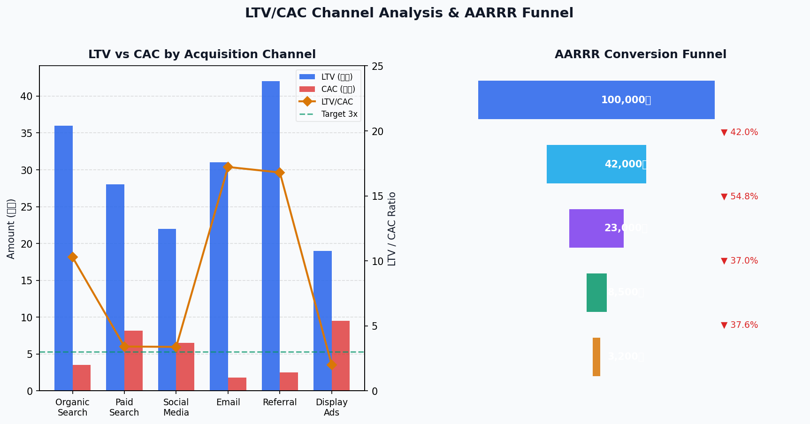
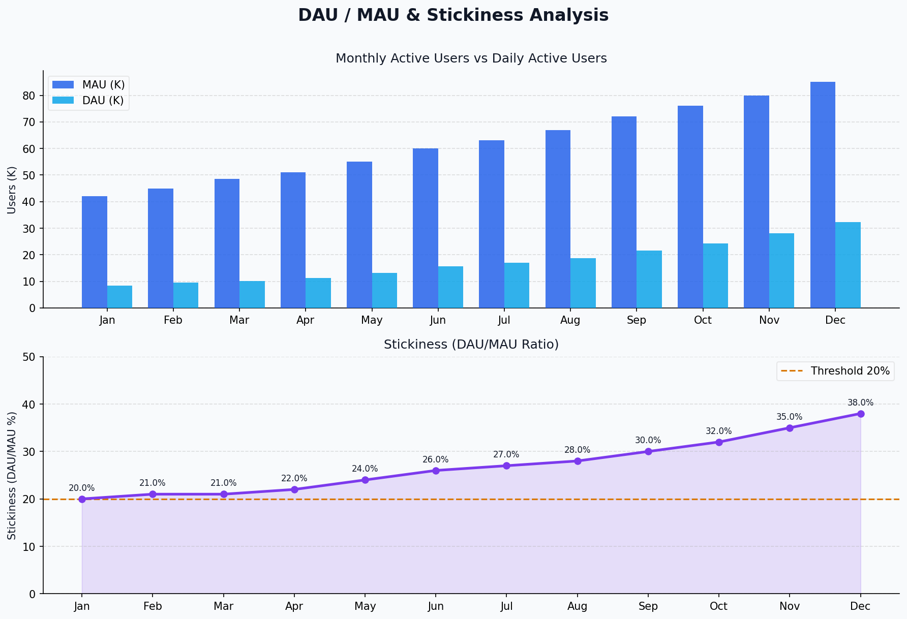
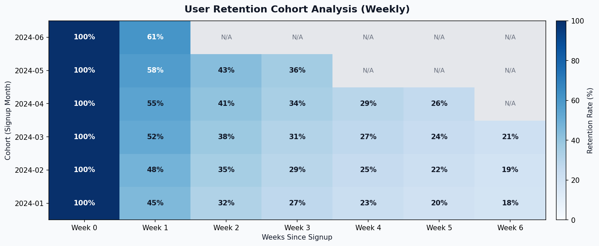
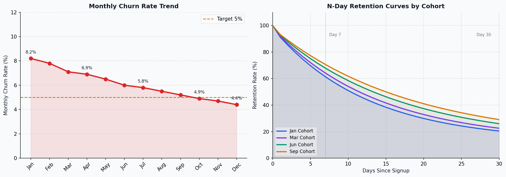

# 데이터 분석가가 실제로 보는 핵심 지표들

> "지표가 너무 많아서 뭘 봐야 할지 모르겠어요"  
> 데이터 분석가의 역할은 숫자를 나열하는 게 아니라, **어떤 숫자가 문제를 말하고 있는지** 골라내는 것입니다.

---

## 분석가가 지표를 바라보는 관점

마케터는 "DAU가 올랐으니 캠페인이 성공했다"고 볼 수 있습니다.  
하지만 데이터 분석가는 다르게 봅니다.

- DAU가 올랐는데 **세션 길이는 줄었나?**
- 신규 유입이 올랐는데 **7일 리텐션은 유지되고 있나?**
- LTV/CAC 비율이 채널마다 **왜 이렇게 다른가?**

지표 하나의 증감보다, **지표들 사이의 관계와 맥락**을 읽는 것이 분석가의 일입니다.

---

## AARRR 프레임워크 — 분석가의 진단 체계

AARRR은 사용자 여정을 5단계로 구조화한 프레임워크입니다. 분석가 입장에서는 이 흐름을 **퍼널(Funnel)**로 보고, 각 단계 전환율의 병목(Bottleneck)을 찾는 데 씁니다.

```python
import pandas as pd
import numpy as np

# AARRR 단계별 사용자 수 (샘플 데이터)
funnel_data = {
    'stage': ['Acquisition', 'Activation', 'Retention', 'Revenue', 'Referral'],
    'users':  [100000, 42000, 23000, 8500, 3200]
}
df_funnel = pd.DataFrame(funnel_data)

# 단계별 전환율 계산
df_funnel['conversion_rate'] = (
    df_funnel['users'] / df_funnel['users'].shift(1) * 100
).round(2)

df_funnel['overall_rate'] = (
    df_funnel['users'] / df_funnel['users'].iloc[0] * 100
).round(2)

print(df_funnel.to_string(index=False))
```

```
       stage   users  conversion_rate  overall_rate
 Acquisition  100000              NaN        100.00
  Activation   42000            42.00         42.00
   Retention   23000            54.76         23.00
     Revenue    8500            36.96          8.50
    Referral    3200            37.65          3.20
```



위 퍼널에서 분석가가 주목할 포인트는 **Activation → Retention 전환(54.76%)보다 Acquisition → Activation 전환(42%)이 훨씬 낮다**는 점입니다. 유입된 사용자 중 절반 이상이 핵심 기능을 경험하기도 전에 이탈한다는 뜻이므로, 온보딩 개선이 최우선 과제가 됩니다.

---

## DAU / MAU — 서비스의 생활화 지수

DAU(일간 활성 사용자)와 MAU(월간 활성 사용자)는 단독으로보다 **비율(Stickiness)**로 볼 때 의미가 커집니다.

```python
# DAU / MAU Stickiness 계산
monthly_data = {
    'month': ['Jan','Feb','Mar','Apr','May','Jun',
              'Jul','Aug','Sep','Oct','Nov','Dec'],
    'mau':   [42000,45000,48500,51000,55000,60000,
              63000,67000,72000,76000,80000,85000],
    'dau':   [8400, 9450,10185,11220,13200,15600,
              17010,18760,21600,24320,28000,32300]
}
df = pd.DataFrame(monthly_data)
df['stickiness'] = (df['dau'] / df['mau'] * 100).round(2)
df['mau_growth'] = df['mau'].pct_change() * 100
df['dau_growth'] = df['dau'].pct_change() * 100

print(df[['month','mau','dau','stickiness']].to_string(index=False))
```

```
 month    mau    dau  stickiness
   Jan  42000   8400       20.00
   Feb  45000   9450       21.00
   Mar  48500  10185       21.00
   Apr  51000  11220       22.00
   May  55000  13200       24.00
   Jun  60000  15600       26.00
   Jul  63000  17010       27.00
   Aug  67000  18760       28.00
   Sep  72000  21600       30.00
   Oct  76000  24320       32.00
   Nov  80000  28000       35.00
   Dec  85000  32300       38.00
```



**Stickiness 해석 기준:**

| 범위 | 해석 |
|------|------|
| < 20% | 생활화 약함. 핵심 기능 재점검 필요 |
| 20 ~ 30% | 준수. 꾸준한 개선 필요 |
| 30 ~ 50% | 높은 참여도. 습관적 사용 중 |
| > 50% | SNS·메신저 수준의 생활화 |

위 예시는 20%에서 시작해 38%까지 지속 성장하는 건강한 패턴입니다. MAU 성장률보다 DAU 성장률이 더 가파른 것도 긍정적인 신호입니다.

---

## Cohort Retention — 분석가가 가장 즐겨 보는 지표

리텐션은 단순한 수치보다 **코호트(Cohort) 분석**으로 봐야 진짜 패턴이 보입니다. 같은 달에 가입한 사용자 그룹이 시간이 지나며 얼마나 남아있는지를 추적합니다.

```python
# 코호트 리텐션 테이블 생성
cohorts = ['2024-01','2024-02','2024-03','2024-04','2024-05','2024-06']
retention_matrix = np.array([
    [100, 45, 32, 27, 23, 20, 18],
    [100, 48, 35, 29, 25, 22, 19],
    [100, 52, 38, 31, 27, 24, 21],
    [100, 55, 41, 34, 29, 26,  0],
    [100, 58, 43, 36,  0,  0,  0],
    [100, 61,  0,  0,  0,  0,  0],
], dtype=float)

# 관측 가능한 데이터만 마스킹
df_retention = pd.DataFrame(
    retention_matrix,
    index=cohorts,
    columns=[f'Week {i}' for i in range(7)]
).replace(0, np.nan)

print(df_retention.to_string())
```

```
         Week 0  Week 1  Week 2  Week 3  Week 4  Week 5  Week 6
2024-01   100.0    45.0    32.0    27.0    23.0    20.0    18.0
2024-02   100.0    48.0    35.0    29.0    25.0    22.0    19.0
2024-03   100.0    52.0    38.0    31.0    27.0    24.0    21.0
2024-04   100.0    55.0    41.0    34.0    29.0    26.0     NaN
2024-05   100.0    58.0    43.0    36.0     NaN     NaN     NaN
2024-06   100.0    61.0     NaN     NaN     NaN     NaN     NaN
```



**코호트 분석에서 읽어야 할 것들:**

- **세로(열) 방향**: 같은 Week에서 코호트가 갈수록 리텐션이 올라간다면, 서비스가 개선되고 있다는 신호입니다. (Week 1: 45% → 61%로 상승 ✅)
- **가로(행) 방향**: 가입 후 시간이 지날수록 얼마나 유지되는지 감소 패턴을 봅니다. 특정 Week에서 급격히 꺾이면 그 시점에 이탈 원인이 있습니다.
- **수평 안정화(Flattening)**: 리텐션 곡선이 특정 값에서 수평이 되면, 그게 해당 서비스의 **핵심 사용자 비율(Power User Ratio)**입니다.

---

## Churn Rate & N-Day Retention Curve

이탈률(Churn Rate)은 리텐션의 반대 개념으로, **이미 사용 중이던 사용자가 떠나는 비율**입니다.

```python
# Churn Rate 계산
churn_data = {
    'month': ['Jan','Feb','Mar','Apr','May','Jun',
              'Jul','Aug','Sep','Oct','Nov','Dec'],
    'start_users': [10000,10800,11500,12200,13000,13800,
                    14500,15200,16000,16800,17500,18200],
    'churned':     [  820,  842,  817,  842,  845,  828,
                      841,  836,  832,  823,  823,  801]
}
df_churn = pd.DataFrame(churn_data)
df_churn['churn_rate'] = (
    df_churn['churned'] / df_churn['start_users'] * 100
).round(2)

# 월별 이탈 비용 추정 (ARPU 3만원 가정)
ARPU = 30000
df_churn['revenue_lost'] = df_churn['churned'] * ARPU

print(df_churn[['month','churn_rate','churned','revenue_lost']].to_string(index=False))
```

```
 month  churn_rate  churned  revenue_lost
   Jan        8.20      820      24600000
   Feb        7.80      842      25260000
   Mar        7.10      817      24510000
   Apr        6.90      842      25260000
   May        6.50      845      25350000
   Jun        6.00      828      24840000
   Jul        5.80      841      25230000
   Aug        5.50      836      25080000
   Sep        5.20      832      24960000
   Oct        4.90      823      24690000
   Nov        4.70      823      24690000
   Dec        4.40      801      24030000
```



Churn Rate이 8.2%에서 4.4%로 절반 수준으로 개선됐지만, 이탈로 인한 월 매출 손실(약 2,400~2,500만원)은 거의 그대로입니다. **MAU가 꾸준히 늘면서 이탈자 수 자체는 유지**되기 때문입니다. 이처럼 비율과 절대값을 함께 봐야 실제 비즈니스 영향을 정확히 파악할 수 있습니다.

---

## LTV / CAC — 비즈니스 지속가능성의 핵심

LTV(고객 생애 가치)와 CAC(고객 획득 비용)의 비율은 "이 사업이 돈이 되는 구조인가"를 판단하는 지표입니다. 분석가는 이를 **채널별로 분해**해서 어디에 예산을 집중해야 할지 근거를 만듭니다.

```python
# 채널별 LTV / CAC 분석
channel_data = {
    'channel':      ['Organic Search', 'Paid Search', 'Social Media',
                     'Email', 'Referral', 'Display Ads'],
    'ltv':          [360000, 280000, 220000, 310000, 420000, 190000],
    'cac':          [ 35000,  82000,  65000,  18000,  25000,  95000],
    'monthly_users':[  2500,   1800,   2200,   3100,   1200,   1500]
}
df_ch = pd.DataFrame(channel_data)
df_ch['ltv_cac_ratio']    = (df_ch['ltv'] / df_ch['cac']).round(2)
df_ch['payback_months']   = (df_ch['cac'] / (df_ch['ltv'] / 24)).round(1)
df_ch['total_ltv_value']  = df_ch['ltv'] * df_ch['monthly_users']

# 채널 우선순위 판단
df_ch['priority'] = df_ch['ltv_cac_ratio'].apply(
    lambda x: '🟢 확대' if x >= 5 else ('🟡 유지' if x >= 3 else '🔴 축소')
)

print(df_ch[['channel','ltv_cac_ratio','payback_months','priority']].to_string(index=False))
```

```
          channel  ltv_cac_ratio  payback_months priority
  Organic Search          10.29             2.3   🟢 확대
     Paid Search           3.41             7.0   🟡 유지
    Social Media           3.38             7.1   🟡 유지
           Email          17.22             1.4   🟢 확대
        Referral          16.80             1.4   🟢 확대
     Display Ads           2.00            12.0   🔴 축소
```


**분석가가 이 표에서 이끌어낼 인사이트:**

- **이메일·추천(Referral)** 채널은 LTV/CAC가 17배 수준으로 압도적입니다. 예산을 더 투자할 여력이 있습니다.
- **Display Ads**는 LTV/CAC 2.0으로 손익분기점(3.0) 미달입니다. ROI 관점에서 예산 재배분을 검토해야 합니다.
- **Payback Period(회수 기간)**: Display Ads는 투자 비용을 회수하는 데 12개월이 걸립니다. 현금 흐름이 빡빡한 스타트업에서는 치명적일 수 있습니다.

---

## 분석가가 지표를 다룰 때 지켜야 할 원칙

### 1. 북극성 지표(North Star Metric)를 먼저 정하라

모든 지표를 동시에 관리하는 것은 불가능합니다. 서비스의 핵심 가치를 가장 잘 표현하는 **단 하나의 지표**를 정하고 팀 전체가 그것을 기준으로 정렬해야 합니다.

| 서비스 유형 | North Star Metric 예시 |
|------------|----------------------|
| 커머스 | 월간 구매 완료 건수 |
| SaaS | 주간 활성 워크스페이스 수 |
| 콘텐츠 | 주간 총 시청 시간 |
| 커뮤니티 | 월간 콘텐츠 생산 사용자 수 |

### 2. 허영 지표(Vanity Metric)를 경계하라

누적 가입자 수, 총 앱 다운로드 수처럼 **숫자는 커 보이지만 실제 서비스 상태를 반영하지 못하는 지표**를 허영 지표라 합니다. 가입자 100만 명이라도 MAU가 1만 명이면 의미가 없습니다.

### 3. 지표는 반드시 세그먼트로 쪼개라

"전체 전환율 3.2%"는 아무 말도 하지 않습니다. **신규 vs 기존 사용자, 모바일 vs 웹, 채널별, 지역별**로 분해했을 때 진짜 인사이트가 나옵니다.

```python
# 세그먼트별 전환율 비교 예시
segment_data = {
    'segment':         ['신규_모바일', '신규_웹', '기존_모바일', '기존_웹'],
    'visitors':        [15000, 8000, 22000, 12000],
    'conversions':     [  300,  280,  1540,   960]
}
df_seg = pd.DataFrame(segment_data)
df_seg['cvr'] = (df_seg['conversions'] / df_seg['visitors'] * 100).round(2)
print(df_seg.to_string(index=False))
```

```
       segment  visitors  conversions   cvr
   신규_모바일     15000          300  2.00
       신규_웹      8000          280  3.50
   기존_모바일     22000         1540  7.00
       기존_웹     12000          960  8.00
```

전체 전환율이 같더라도, **신규 모바일 사용자(2%)와 기존 웹 사용자(8%) 사이에는 4배 차이**가 있습니다. 전체 수치만 보면 이 격차를 놓칩니다.

---

## 정리하며

데이터 분석가가 지표를 보는 방법을 요약하면 다음과 같습니다.

- **AARRR 구조**로 어느 단계에서 병목이 생기는지 진단한다
- **DAU/MAU Stickiness**로 서비스 생활화 수준을 측정한다
- **Cohort Retention**으로 시간에 따른 사용자 유지 패턴을 추적한다
- **Churn Rate**는 비율과 절대값을 모두 본다
- **LTV/CAC**를 채널별로 분해해 예산 배분의 근거로 만든다
- 모든 지표는 **세그먼트로 쪼개야** 진짜 인사이트가 나온다

지표는 정답을 알려주지 않습니다. **무엇을 물어봐야 할지** 알려주는 도구입니다.

---

